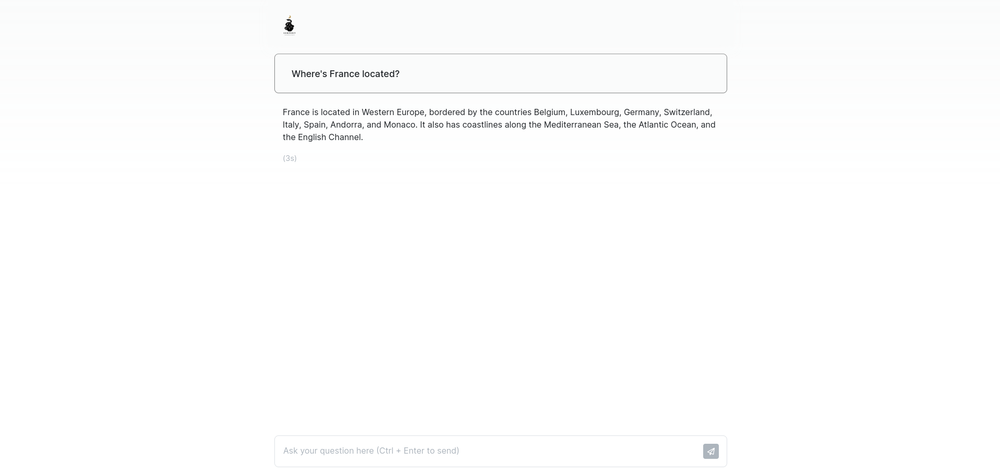

# serpent

This documentation provides an overview and explanation of the code for a ChatGPT clone that acts as a Language Model (LLM) using the OpenAI API. The application is built in Go and utilizes the Chi router for handling HTTP requests.

## Website

Explore the Serpent Language Model on my website:

[serpentllm.up.railway.app](serpentllm.up.railway.app)

## Screenshots

Front end of the web app:


Interaction with the language model:



## Dependencies

- `github.com/go-chi/chi/v5:` A lightweight, idiomatic and composable router for building Go HTTP services
- `github.com/go-chi/chi/v5/middleware:` Middleware package for Chi router, including a logger.
- `github.com/joho/godotenv:` A Go package to load environment variables from a file.
- `github.com/tmc/langchaingo/llms/openai:` A custom package for interacting with the OpenAI API.
- `github.com/tmc/langchaingo/schema:` A custom package defining schema structures for communication with the language model.

## Installation

Before running the application, ensure that you have the necessary dependencies installed. You can use the following command to install the required packages:

```bash
go get -u github.com/go-chi/chi/v5 github.com/joho/godotenv github.com/tmc/langchaingo/llms/openai github.com/tmc/langchaingo/schema
```

## Configuration

The application requires a configuration file named .env to be present in the project root. The following environment variables must be defined in the file:

- OPENAI_API_KEY: Your own API key from OpenAI
- PORT: The port on which the application will listen for incoming HTTP requests.
- OPENAI_MODEL: The identifier of the OpenAI language model to be used.

You can find the example in `.env.example` file.

## Code Structure

### Initialization

The `init` function loads environment variables from the `.env` file using the `godotenv` package.
Main Function

The `main` function sets up the Chi router, initializes middleware, defines routes, and starts the HTTP server.
Routes

1. **Static Files:** The router serves static files from the `static` directory.

2. **Index Page (/):** The `index` function renders the HTML page located in the `static` directory.

3. **Run Endpoint (/run):** The `run` function handles POST requests to the `/run` endpoint. It decodes JSON input from the client, creates an instance of the OpenAI language model, makes a call to the model, and returns the response.

### Language Model Interaction

The `openai.NewChat` function initializes the OpenAI language model with the specified model identifier.

The `run` function communicates with the language model by sending a series of chat messages. It includes a system message and the user's input. The response from the language model is then returned to the client.

## Usage

1. Ensure the required environment variables are set in the `.env` file.

2. Run the application using the following command:
```bash

go run main.go
```
3. Access the application in a web browser at `http://localhost:<PORT>`.

4. Enter text in the input field, submit the form, and observe the response from the OpenAI language model.

## Error Handling

The application includes error handling for various scenarios, such as JSON decoding errors, OpenAI model initialization errors, and communication errors with the language model.

## Conclusion

This ChatGPT clone provides a simple web interface for interacting with the OpenAI language model. Users can input text, and the application will return responses generated by the language model. The codebase is modular and can be extended to add more features or customize the user interface.
